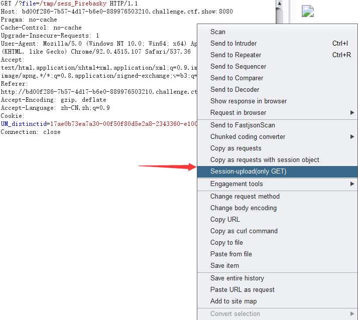

# Session-upload

[中文版本(Chinese version)](README.zh-cn.md)

>This project is a plug-in of burpsuite, which aims to quickly generate POC in case of conditional competition for session upload.

### Session-upload-by-Firebasky.jar

Using the burpsuite plug-in




**With this plug-in, you don't need to use HTML to capture and modify!!!**
**Maybe the plug-in is only for lazy people like me!!!**

```php+HTML
<!DOCTYPE html>
<html>
<body>
<form action="" method="POST" enctype="multipart/form-data">
<input type="hidden" name="PHP_SESSION_UPLOAD_PROGRESS" value="2333" />
<input type="file" name="file" />
<input type="submit" value="submit" />
</form>
</body>
</html>
```

### exp.py

It is used by Python script.

It can be considered comprehensively according to the topic.
