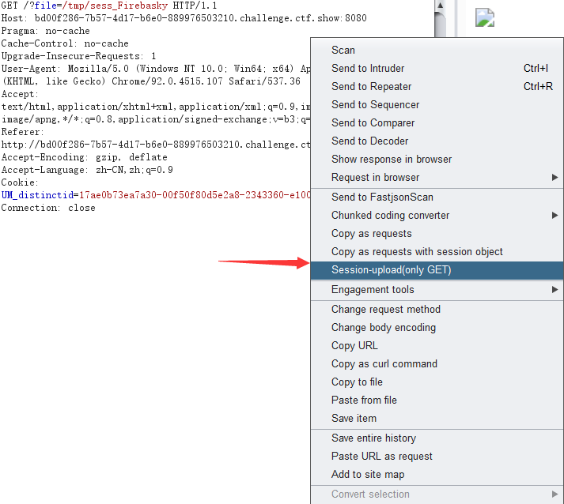
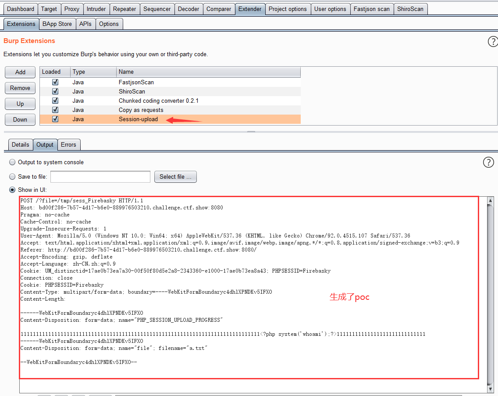

# Session-upload

>该项目是burpsuite的插件，目的是在遇到Session上传的条件竞争中快速生成poc。

### Session-upload-by-Firebasky.jar

通过burpsuite插件的方式利用





**有了这个插件就不需要使用html来抓包修改啦！！！**

```php+HTML
<!DOCTYPE html>
<html>
<body>
<form action="" method="POST" enctype="multipart/form-data">
<input type="hidden" name="PHP_SESSION_UPLOAD_PROGRESS" value="2333" />
<input type="file" name="file" />
<input type="submit" value="submit" />
</form>
</body>
</html>
```

### exp.py

是通过python的脚本的方式进行利用。

根据题目可以综合考虑。
